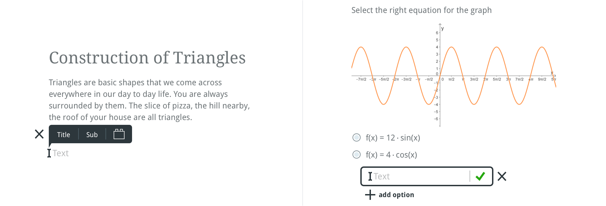

<p><br></p>
<p align="center">
	
</p>
<p align="center">
<a href="https://edtr.io">www.edtr.io</a>
</p>
<br><br></p>

<h2 align="center">Content Editing for the Modern Web</h2>

<p align="center">
Edtr.io is a WYSIWYG in-line web editor written in React.<br>
Content created with edtr.io looks just like the final page -<br>
select any editable element on the page, edit it in-place or drag ’n’ drop it around.<br>
Its plugin architecture makes edtr.io lean AND adaptable to any use case at the same time.<br>
Edtr.io is of course Open Source.<br>
</p>
<p><br><br></p>

## The Editor

### Core Characteristics

Edtr.io's plugin architecture makes it adapt to virtually any use case. Platform providers have full control over the available editing options. The edtr.io project provides a lean core of basic functionalities. For Rich Text editing, we build on Slate.js.

Edtr.io is based on reusable React components. Implementing and integrating a plugin only requires a few lines of code. You decide how data gets persisted; the state is a normalized JSON object, no HTML is involved. Plugins support undo/redo out of the box.

Edtr.io has UX at heart. Our core implements a consistent user experience. Building plugins from reusable elements ensures a uniform look and feel. Integrating edtr.io into an existing applications is simple: all functionalities are fully customizable, theming can be applied from ground up.

In-line editors provide an easy way to work on web content. Content creators work directly on elements, adding and changing them in-place. Everything just looks like the final page. Users do not need knowledge of markup languages or any special training.

<p align="center">
	
</p>

### Basic Features

- Rich text editing
- Drag ’n’ drop content sorting
- Global undo/redo
- Mobile preview

### Basic Plugins

- Image upload
- Blockquote
- Spoiler
- Markdown table
- Youtube video integration (in development)
- Vimeo video integration (in development)
- Wiki Commons video integration (in development)

### Plugins for Education

- Input text exercise
- Matching exercise
- Multiple and single choice exercise
- Basic equations
- Wiris equation editor
- GeoGebraTube integration
- H5P.com integration
- Serlo.org content integration

### Further Plugins

- Code highlighting

Feel free to write your own plugin to extend edtr.io for your use case!

### Status

[](https://github.com/edtr-io/edtr-io/actions?query=branch%3Amaster) [](https://github.com/orgs/edtr-io/projects/1)

Edtr.io is currently in active development. Our working prototype is in use and being tested since June on serlo.org.
Watch this space, there will be a public demo soon.

### Local Developement

```
git clone https://github.com/edtr-io/edtr-io.git
cd edtr-io
yarn
yarn start
```

That should be all!
(When yarn fails try using the current node lts)

## Committed to Simplicity and Openness

Edtr.io is backed by Open Education heavyweights: serlo.org and the HPI Schul-Cloud, and supported by Splish.

It has been born from the needs of the learning platform [serlo.org](https://serlo.org/) and builds on the original work of Serlo’s co-founder and CTO [Aeneas Rekkas](https://github.com/aeneasr). Serlo.org is inspired by Wikipedia and already provides thousands of articles, videos and exercises for one million German students every month. Serlo.org is growing steadily. In 2018, the platform went international.

In 2019, Serlo partnered with the German [Schul-Cloud](https://hpi.de/en/open-campus/hpi-initiatives/schul-cloud.html), started by the Hasso Plattner Institute (HPI) in cooperation with MINT-EC, and funded by the Federal Ministry for Education and Research. The HPI Schul-Cloud aims to provide low-threshold access to digital educational content to schools nationwide.

[Splish](http://splish.me) was founded in 2016 by the very people working on the editor, to be able to provide commercial support.

Great content editing is essential for the user experience of a community-driven site - edtr.io’s main purpose is to make editing on the web easy for students and teachers.

We love education. We need this editor. We're in for the long haul.

<p align="center">
	<br>
	<a href="https://serlo.org/">
		
	</a>
	<a href="https://hpi.de/">
		
	</a>
	<a href="http://splish.me">
		
	</a>
	<br><br>
</p>

## License

Edtr.io is under MIT license.

## Contacts

In case you want to use the editor for the education sector,\
 contact [serlo.org](mailto:en@serlo.org)

### Commercial Support

Commercial integration, custom plugin development and support is available from Splish.me, from the same knowledgeable people writing the code for edtr.io's core functionalities. For inquiries, please contact [edtr-io@splish.me](mailto:edtr-io@splish.me).

### Want to contribute?

Contributions welcome!
You can reach our development team at [en@serlo.org](mailto:en@serlo.org)

## Learn More

About [serlo.org and its vision](https://en.serlo.org/serlo)\
About the [Hasso Plattner Institut](https://hpi.de/en/the-hpi/overview.html)\
About our integration partner, [Splish](http://splish.me)\
About the [HPI Schul-Cloud](https://hpi.de/en/open-campus/hpi-initiatives/schul-cloud.html)
